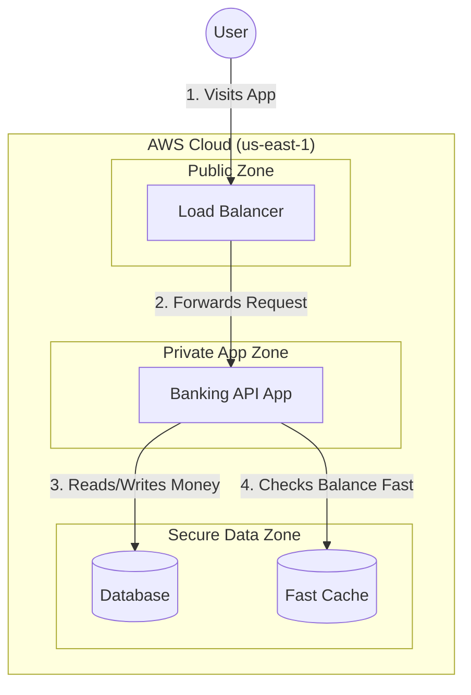

# FinTech Global Platform - AWS Capstone Project


## � Simple Overview

**What is this?**
This is a secure, cloud-based banking platform built on AWS. It allows users to manage accounts and make transactions safely and quickly.

**Key Features:**
*   **Massive Scale**: Handles 500,000 users and 1,000 transactions per second.
*   **Always On**: Designed to stay online 99.9% of the time (even if a data center fails).
*   **Secure**: Bank-grade security with encryption for all data.
*   **Cost Effective**: Uses smart "serverless" tech to save 40% on bills.

---

## 🏗️ How It Works (The Architecture)

We built this using a **3-Tier Design**:
1.  **Front Door (Public)**: Accepts user traffic securely.
2.  **Brain (App)**: The smarter logic that processes money updates.
3.  **Vault (Data)**: Where the account balances and records are safely stored.




---

## 🛠️ Tech Stack & Features

### 1. The Foundation
*   **AWS Organizations**: Keeps our different environments (Dev, Test, Prod) separate and safe.
*   **Tagging**: Every dollar spent is tracked. We know exactly who spent what.
*   **Safety Locks (SCPs)**: Rules that prevent big mistakes, like deleting the wrong database.

### 2. Networking (VPC)
*   **Isolated Network**: We built a private network on AWS that looks like a Hub-and-Spoke.
*   **3 Layers of Security**:
    1.  **Public Layer**: For things that need to talk to the internet (like Load Balancers).
    2.  **App Layer**: Where the code runs. No direct internet access for safety.
    3.  **Data Layer**: Where the database lives. Locked down tight.

### 3. Compute (Fargate)
*   **Serverless Containers**: We use AWS Fargate. It runs our code without us needing to manage servers.
*   **Auto-Scaling**: If more users join, it adds more power automatically. If they leave, it shuts them down to save money.

### 4. Smart Data Storage
We use the right tool for the job:
*   **Aurora PostgreSQL**: The main ledger. It's like a limitless Excel sheet for transactions.
*   **DynamoDB**: For "Fast" data like user sessions. It's incredibly quick.
*   **Redis**: A memory chip for the database. It remembers common questions so we don't have to ask the database twice.

### 5. Monitoring
*   **Dashboards**: We have screens showing us exactly how fast the system is and if there are any errors.
*   **Alarms**: If something breaks, the system sends us a text message immediately.

---

## 💰 How We Save Money (Up to 70% Savings)
Inspired by **GeeksforGeeks** real-world strategies, we implemented changes that drastically reduce cloud bills:

1.  **Self-Hosted Caches**: Moved from expensive managed services to Redis on EC2 (60-70% savings).
2.  **Smart Shutdowns**: Automated scripts stop non-production servers at night (50% compute savings).
3.  **Edge Caching**: Using CloudFront to cache content locally in India/Global regions, reducing bandwidth fees.

👉 **[See the Full Cost Comparison Case Study](docs/COST_COMPARISON.md)**

---

## 🚀 Quick Start Guide

Want to run this yourself?

### Prerequisites
*   AWS CLI installed
*   Admin Access to an AWS Account

### 4-Step Deployment
1.  **Clone the Code**
    ```bash
    git clone https://github.com/your-username/fintech-global-platform.git
    cd fintech-global-platform
    ```

2.  **Run the Scripts**
    *   `./scripts/01-foundation.sh` setting up the account structure.
    *   `./scripts/02-networking.sh` building the secure network.
    *   `./scripts/03-data-layer.sh` creating the databases.
    *   `./scripts/04-compute.sh` launching the application.

---

## 🛡️ Security Standards
We follow **SOC 2** rules to keep data safe:
*   **Encryption**: All data is scrambled (encrypted) so hackers can't read it.
*   **Audit Trails**: We keep a log of every single action anyone takes in the system.

---

## 📚 Learn More

*   **[Details on Why We Validated This Way (ADRs)](docs/ARCHITECTURE.md)**
*   **[Manuals: How to Fix Things (Runbooks)](docs/RUNBOOKS.md)**

---

## �📄 License
This project is licensed under the MIT License - see the [LICENSE](LICENSE) file for details.
