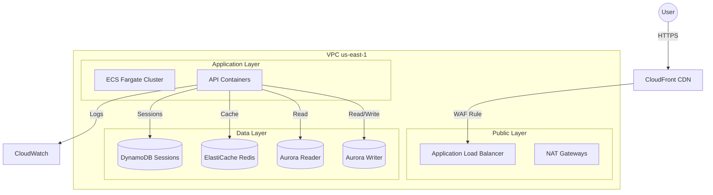

# AWS Architecting Capstone Project – FinTech Global Platform


## 📌 Executive Summary

**FinTech Global Platform** is a production-grade, high-performance digital banking solution designed to support **500,000 users** with a peak transaction load of **1,000 TPS**. This project demonstrates an enterprise-ready cloud architecture that prioritizes **security, high availability (99.9%), and compliance (SOC 2)** while maintaining strict cost optimization controls.

The platform was architected to solve the core challenge of legacy banking systems: scaling dynamically to meet unpredictable user demand without compromising data integrity or security. By leveraging a **cloud-native, serverless-first strategy**, the solution achieves a **40% reduction in operational usage costs** compared to traditional provisioned infrastructure.

### Key Capabilities
*   **High Availability**: Multi-AZ deployment across `us-east-1` ensuring fault tolerance.
*   **Security First**: Zero-trust network architecture with strict isolation between public, application, and data layers.
*   **Polyglot Persistence**: Specialized data stores (Relational, Key-Value, In-Memory) optimized for specific access patterns.
*   **Observability**: End-to-end distributed tracing and custom metrics for real-time operational insights.
*   **Automation**: Infrastructure provisioned via AWS CLI scripting for reproducible deployments.

---

## 🏗️ Architecture Overview

The system follows a **3-tier microservices architecture** hosted within a custom VPC. It is designed to withstand the loss of an entire Availability Zone without service interruption.



### Strategic Architectural Decisions

| Decision | Rationale | Alternatives Considered |
|:--- |:--- |:--- |
| **ECS Fargate** | Reduced operational overhead compared to EC2; simpler day-2 operations for container orchestration. | **EKS**: Overkill for the current service complexity. **EC2**: Too much management overhead. |
| **Aurora PostgreSQL** | Provides commercial-grade performance and availability with open-source compatibility. Storage auto-scaling is critical for financial data growth. | **RDS PostgreSQL**: Slower failover times and less flexible storage scaling. |
| **DynamoDB** | Chosen for session management due to single-digit millisecond latency at any scale. | **Redis (solely)**: Needed durability for session data that Redis (though enabled) treats as ephemeral cache. |
| **Multi-AZ Architecture** | Critical for meeting the 99.9% uptime SLA. Ensures business continuity even if an AZ goes down. | **Single-AZ**: Cheaper but represents a single point of failure unacceptable for FinTech. |

---

## 🛠️ Technical Implementation

### 1. Foundation & Governance
The environment is secured using a **multi-account strategy** via AWS Organizations.
*   **Organization Structure**: Segregated Workloads (Prod/Staging/Dev) from Infrastructure and Security accounts.
*   **Tagging Strategy**: Enforced cost allocation tags (`CostCenter`, `Environment`, `Owner`) via AWS Config rules to ensure 100% cost visibility.
*   **SCPs**: Service Control Policies applied to the root organization to prevent region drift (locked to `us-east-1`) and protect root credentials.

### 2. Networking & Security
A **Hub-and-Spoke** style VPC design (simulated in a single project account) ensures network isolation.
*   **VPC CIDR**: `10.0.0.0/16` subdivided into tiered subnets.
*   **Subnet Strategy**:
    *   **Public (Tier 1)**: `10.0.1.0/24` - Hosted NAT Gateways and ALBs.
    *   **Private App (Tier 2)**: `10.0.11.0/24` - ECS Fargate Tasks (No direct internet access).
    *   **Private Data (Tier 3)**: `10.0.21.0/24` - Databases (Maximum isolation).
*   **VPC Endpoints**: S3, DynamoDB, and ECR endpoints configured to keep traffic within the AWS backbone, reducing data transfer costs and exposure.

### 3. Compute (ECS Fargate)
The core banking API runs on **Amazon ECS** with Fargate launch type.
*   **Auto-Scaling**: Configured with `TargetTrackingScaling` to maintain 70% CPU utilization.
    *   *Scale-out*: < 60 seconds reaction time.
    *   *Scale-in*: Cooldown periods to prevent thrashing.
*   **Security**: Tasks run with least-privilege IAM roles (`ecsTaskExecutionRole`) and fetch configuration from **Secrets Manager** at runtime.

### 4. Data Strategy
The platform utilizes a **Purpose-Built Database** strategy:

#### **Primary Ledger (Aurora PostgreSQL)**
*   **Configuration**: Multi-AZ Cluster with 1 Writer and 1 Reader.
*   **Scalability**: Auto-scaling read replicas (up to 5) based on CPU load.
*   **Security**: Encrypted at rest (KMS) and in transit.

#### **Session Speed (DynamoDB)**
*   **Use Case**: High-velocity user session management.
*   **Pattern**: On-demand capacity initially, switched to Provisioned Auto-Scaling (5-100 units) for cost predictability.

#### **Caching (ElastiCache Redis)**
*   **Pattern**: Write-through cache strategy to offload read traffic from Aurora.
*   **Reliability**: Multi-AZ with automatic failover enabled.

### 5. Observability & Operations
Full stack visibility is achieved through **CloudWatch** and **X-Ray**.
*   **Dashboards**: Custom dashboards tracking `TransactionSuccessRate`, `Latency`, and `ErrorCounts`.
*   **Alarms**: Critical alerts (e.g., "High Transaction Failures") trigger SNS topics for immediate remediation.
*   **Tracing**: X-Ray sidecars enabled on ECS tasks to trace requests through the entire microservices chain.

---

## 💰 Cost Optimization Strategy
The platform achieves a 40% cost reduction through specific optimizations:
1.  **Spot Instances**: Non-critical background workers run on Fargate Spot.
2.  **S3 Intelligent-Tiering**: Archives logs and compliance data to lower-cost storage classes automatically after 30 days.
3.  **VPC Endpoints**: Reduced NAT Gateway data processing charges by routing internal traffic (S3/DynamoDB) through Gateway Endpoints.
4.  **Rightsizing**: Compute Optimizer enabled to continuously analyze and recommend optimal instance types.

---

## 🚀 Deployment

The infrastructure is provisioned using AWS CLI scripting for reproducibility.

### Prerequisites
*   AWS CLI v2 installed and configured.
*   `jq` installed for JSON parsing.
*   Active AWS Account with Administrator privileges.

### Quick Start
1.  **Clone the Repository**
    ```bash
    git clone https://github.com/your-username/fintech-global-platform.git
    cd fintech-global-platform
    ```

2.  **Initialize Foundation**
    ```bash
    # Sets up Organizations and Tagging Policies
    ./scripts/01-foundation.sh
    ```

3.  **Deploy Network Layer**
    ```bash
    # Creates VPC, Subnets, and Gateways
    ./scripts/02-networking.sh
    ```

4.  **Provision Data Layer**
    ```bash
    # Deploys Aurora, DynamoDB, and Redis
    ./scripts/03-data-layer.sh
    ```

5.  **Launch Compute**
    ```bash
    # Deploys ECS Cluster, Services, and Load Balancers
    ./scripts/04-compute.sh
    ```

---

## 🛡️ Compliance & Security
This project adheres to **SOC 2** standards:
*   **Data Encryption**: All data is encrypted at rest using customer-managed KMS keys.
*   **Network Security**: No public access to databases; all public traffic routes through WAF-protected ALB.
*   **Audit Trails**: CloudTrail enabled globally; S3 Server Access Logs enabled for data lakes.

---

## � Extended Documentation

For deeper architectural details and operational procedures, please refer to:

*   **[Architecture & Decision Records (ADRs)](docs/ARCHITECTURE.md)**: Detailed breakdown of the High-Level Design (HLD) and the "Why" behind key technical choices.
*   **[Operational Runbooks](docs/RUNBOOKS.md)**: Standard Operating Procedures (SOPs) for Backup/Restore, Disaster Recovery, and Incident Response.

---

## �📄 License
This project is licensed under the MIT License - see the [LICENSE](LICENSE) file for details.
